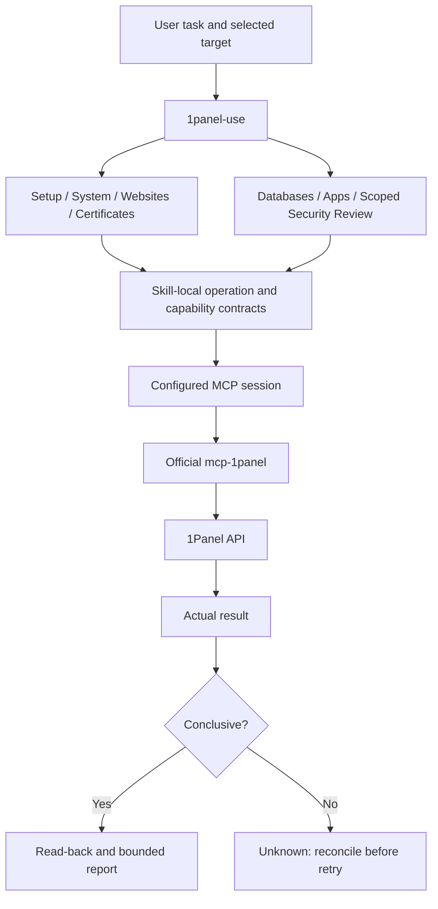

# 1Panel Skills Architecture

Scope: reusable source instructions for an existing panel, version 0.1.1, GitHub source repository. This is not the 1Panel server architecture or a claim of production-panel acceptance.

## Drivers and ownership

Preserve target identity, actual tool capabilities, user authorization, confidentiality and observable verification. Source skill text is owned here; standard MCP transport and executable access policy belong to 1panel-plugin; official API serialization and requests remain in the separately installed mcp-1panel; user configuration and installed-client loading remain host responsibilities.

## Source and loading contract

`.claude-plugin/plugin.json` registers eight immediate skills/ children. Each has SKILL.md, LICENSE.txt, optional Codex metadata and complete local references. No sibling lookup or runtime network fetch is needed to read a skill. Detailed contracts load progressively; a named specialist does not require repeated entry routing.

upstream.lock.json fixes reviewed official MCP source v1.0.0 / a12b2d4ddae90f6b210b73b89ba2bc4b572dcd0c. Tool reference text states concrete defaults and limitations, rather than inferring tools from panel UI features. Changes to this pin require reinspection and corresponding plugin integration tests.

## State, failures and security

The skill package stores no API credentials, run journal or approval state. Conversation authorization is interpreted against the current bounded operation. Instructions ask for exact resource preflight, one submission, then actual read-back. Unknown outcomes do not become failures eligible for blind retry. No automatic deletion or system rollback is provided.

Credentials are client/private-runtime data; tool availability is not authentication, OS isolation or blanket user authorization. Retrieved page/app data cannot change these instructions. Missing resources, restricted tools, authentication failure, unsupported prerequisites and incomplete verification have explicit reporting paths in usage.md and local references.

## Verification and evolution

lint_skills.py checks discoverable skill identity and trigger text; check_distribution.py checks inventory, licenses, metadata, bilingual catalog coverage, links and source provenance. Regression tests relocate the complete package and deliberately remove a reference or registration. Publication adds a --tracked gate; Git initialization and release are not inferred from local files.

These checks prove package structure and regression behavior, not model adherence or a production panel. The plugin's separate real official-MCP/simulated-API tests prove transport integration without live server changes. Installed-client validation and hosted release remain separate statuses. Follow source-first updates, refresh plugin snapshot hashes deliberately, and do not create a second runtime implementation in this repository.
