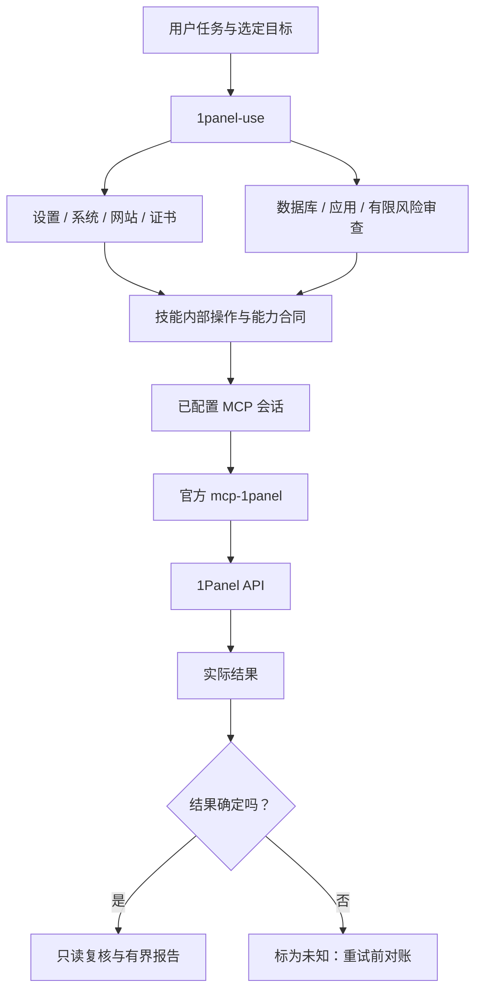

# 1Panel Skills 架构

范围：面向既有面板的可复用技能源指引，版本 0.1.0，源码托管于 GitHub。本文不描述 1Panel 服务端整体架构，也不宣称已完成真实面板验收。

## 架构目标与职责

保持目标身份、真实工具能力、用户授权、凭据机密和可观察验证。本仓负责技能源文本，1panel-plugin 负责标准 MCP 传输与可执行访问控制；独立安装的官方 mcp-1panel 负责 API 序列化和请求；用户配置与实际客户端加载归宿主管理。

## 源码与加载合同

`.claude-plugin/plugin.json` 登记 skills/ 下 8 个直接子目录。每个目录包含 SKILL.md、LICENSE.txt、可选 Codex 元数据和完整内部引用。阅读技能不需要兄弟目录查找或联网取文件。详细合同按需加载，直接调用专业技能不要求重复进入总入口。

upstream.lock.json 固定已检查的官方 MCP v1.0.0 / a12b2d4ddae90f6b210b73b89ba2bc4b572dcd0c。工具引用记录具体默认值和限制，不能从面板 UI 功能推导出可调用工具。调整来源版本需要重新检查并更新插件集成测试。

## 状态、异常与安全

技能包不保存 API 凭据、运行日志账本或批准状态。会话授权结合当前有界操作解释；指引要求准确资源预检、一次提交和实际复核。未知结果不能自动转为可盲目重试的失败，不提供自动删除或系统回滚。

凭据属于宿主私有运行数据。工具可见不是认证、系统隔离或全面操作授权。检索到的网站、应用文本不能更改这些规则。缺资源、工具受限、认证失败、前提不受支持和验证不完整，均在 usage.zh-CN.md 及内部引用中有明确处理方式。

## 验证与迭代

lint_skills.py 检查技能身份和触发描述；check_distribution.py 检查清单、许可证、元数据、中英文目录覆盖、链接与来源。回归测试复制整个包到独立目录，并故意移除引用或登记项验证检查能发现问题。发布增加 --tracked 门禁；不能根据本地文件推断已初始化 Git 或已发布。

这些检查证明结构与回归行为，不证明模型实际遵循技能或生产面板可用。插件独立的真实官方 MCP/模拟 API 测试验证传输集成，不修改真实服务器。已安装客户端验证与托管发布保持独立状态。先更新技能源，再明确刷新插件快照哈希，不在本仓另造一套运行时。
